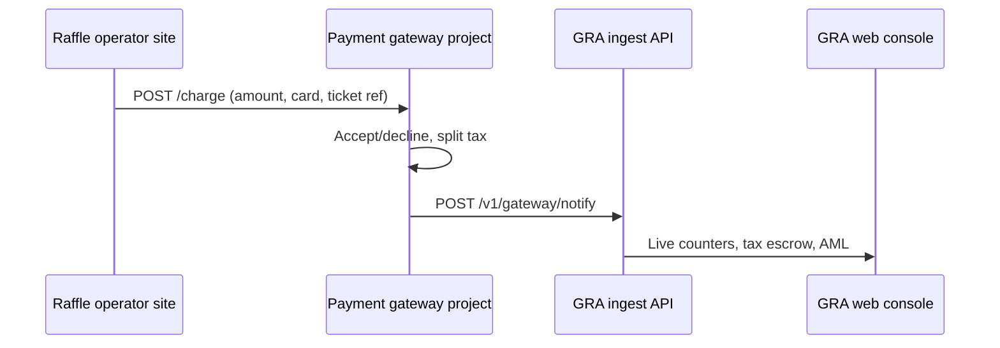

# Payment gateway — separate project

The **payment gateway is not part of `kenji-government`**. It is a **standalone application** (same stack: NestJS, Fastify, TypeScript, Postgres, Redis) that processes ticket payments and **integrates with this GRA oversight console**.

| Repository | Role |
|------------|------|
| **`kenji-government`** (this repo) | GRA staff console — registry, compliance, **oversight** of payments, tax escrow visibility, AML queue, EOD withdrawal records, reports |
| **Payment gateway** (new repo, e.g. `kenji-harambe-pay`) | **Processes** card/M-Pesa payments, splits operator vs government tax, holds escrow, withdraws to treasury — **built and operated as its own service** |

Force42 / Harambe Pay in the business plan = this **separate gateway product**, not code inside the GRA monorepo.

---

## Integration flow



1. **Operator raffle website** sends the customer to the **gateway** (not to GRA).
2. **Gateway** charges the card, applies tax split, generates confirmation.
3. **Gateway** notifies **GRA ingest** so oversight data is recorded (earmarking, AML rules, live feed).
4. **GRA staff** use **this** web app to monitor — they never run the card processor.

---

## What stays in `kenji-government`

| Component | Purpose |
|-----------|---------|
| `POST /v1/gateway/notify` | Receive completed or failed payments from the gateway |
| `GET /v1/gateway/health` | Gateway connectivity check (authenticated) |
| Staff API `/payments/*` | Transactions, escrow, AML, withdrawals UI |
| `system_settings` tax rate | Super admin configures %; ingest applies on gateway events |

---

## What belongs in the gateway project

| Capability | Notes |
|------------|--------|
| `POST /charge` (or `/v1/pay`) | Public API for operator sites |
| Card accept / decline | Real processor or sandbox rules |
| Tax split at payment time | Fetch rate from GRA or env cache |
| Operator settlement ledger | Gateway’s own DB |
| Tax escrow / sub-account ledger | Gateway holds until EOD withdrawal |
| EOD withdrawal to treasury | Calls bank / Harambe treasury APIs |
| Notify GRA on every completed payment | HMAC-signed ingest to `kenji-government` |
| Operator authentication | Gateway issues or validates operator credentials |

Recommended layout (mirror this monorepo):

```
kenji-harambe-pay/
  apps/api/          # NestJS gateway API (:4002)
  apps/worker/       # EOD withdrawal, reconciliation jobs
  packages/database/ # Gateway ledger (separate DB from GRA)
  packages/shared/   # Charge schemas, GRA ingest client
  integrations/      # Operator SDK (PHP/JS) — HarambePayGatewayClient
```

---

## GRA ingest contract (gateway → GRA)

**Base URL:** `https://ingest.<gra-domain>/v1` (local: `http://localhost:4001/v1`)

**Endpoint:** `POST /gateway/notify`

**Headers:** `X-Api-Key`, `X-Signature` (HMAC-SHA256 of body), `X-Idempotency-Key`

**Body (completed):**

```json
{
  "external_transaction_id": "gw-unique-ref",
  "gross_amount": 100,
  "currency": "KES",
  "status": "completed",
  "ticket_reference": "TKT-12345",
  "kyc_status": "verified",
  "payer_fingerprint": "hashed-fp",
  "county": "Nairobi"
}
```

**Body (failed):**

```json
{
  "external_transaction_id": "gw-unique-ref",
  "gross_amount": 100,
  "currency": "KES",
  "status": "failed",
  "decline_reason": "Card declined",
  "ticket_reference": "TKT-12345"
}
```

GRA applies configured tax rate if `tax_amount` / `operator_amount` are omitted.

**Credentials:** Per-operator site API keys (same as ingest sandbox) — gateway stores mapping operator → GRA site credentials.

See also: `docs/API.md`, `packages/shared/src/payments.ts` (`gatewayPaymentSchema`).

---

## Tax rate

Super admins set the government % in **GRA Settings** (this project). The gateway should either:

- Call GRA staff API to read `tax_rate` (service account — to be added), or
- Send only `gross_amount` and let GRA ingest apply the rate (supported today).

---

## Dev / pilot until gateway repo exists

| Tool | Location |
|------|----------|
| `tools/gateway-simulator/simulate-charge.sh` | Simulates gateway card rules → notifies GRA ingest |
| `examples/mock-gateway-charge.sh` | Wrapper for the simulator |
| `integrations/operator/HarambePayGatewayClient.php` | Operator SDK — targets **gateway project** URL |

---

## Phase plan split

| Phase 7 item | Repository |
|--------------|------------|
| 7.1–7.4 Gateway product (charge, split, escrow, withdraw) | **Payment gateway project** |
| 7.5 Notify GRA on payment | Gateway → GRA ingest |
| 7.6–7.20 Oversight DB, UI, AML, reports | **`kenji-government`** (done) |

---

## Next step

Create the gateway repository using the same monorepo pattern as `kenji-government`, implement `POST /charge`, and use `@kenji-government/shared` ingest client (or copy `gatewayPaymentSchema` + signing) to push events to this console.
